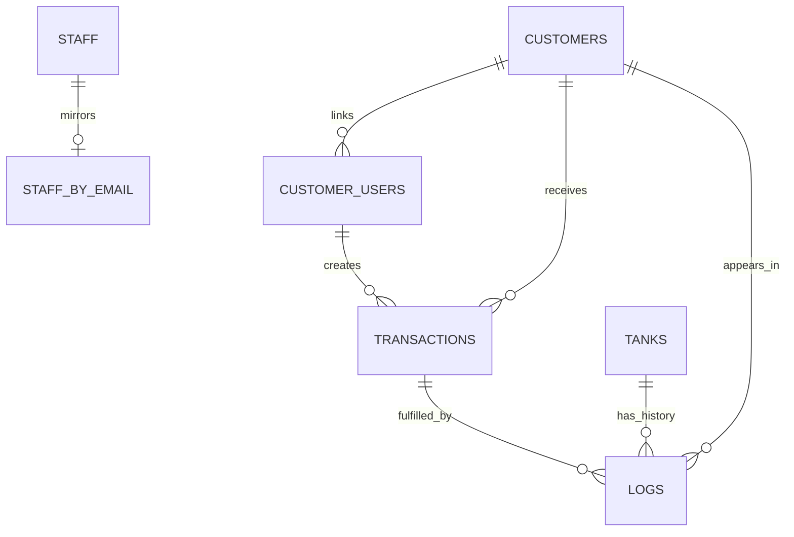

# データベース設計

この文書は、Firestore 上のデータ構造と責任範囲を明文化するための設計書。
現時点の実装を基準にしつつ、今後の正規化方針も併記する。

## 基本方針

- Firestore を主データストアとする。
- 業務上の正本は `tanks`, `logs`, `transactions` を中心に置く。
- 画面表示用の派生値は、原則として保存せず読み込み時に集計する。
- ただし、月次確定値や監査ログなど、後から再計算すると意味が変わる値は保存してよい。
- 日時は原則 Firestore `Timestamp` を使う。
- タンクIDは `A-01` のような大文字・ハイフン形式に正規化する。
- 顧客ポータルは Firebase Auth `uid` と `customerUsers/{uid}` を基準にする。画面互換用に localStorage `customerSession` も保存する。
- スタッフ・管理者権限は `staff` と `staffByEmail` を基準にする。

## 用語

| 用語 | 意味 |
|---|---|
| タンク | レンタル対象の物理タンク。`tanks/{tankId}` で管理する。 |
| ログ | タンク操作の履歴。`logs` に追記型で保存する。 |
| 取引 | 顧客からの発注、顧客返却タグ、未充填報告。`transactions` に保存する。 |
| 貸出先 | タンクの貸出・請求の単位となる会社・店舗。正本は `customers`。 |
| ポータル利用者 | 顧客ポータルにログインする個人。Firebase Auth uid と `customerUsers/{uid}` で管理する。 |

## コレクション一覧

| コレクション | 主な用途 | ドキュメントID | 現状 |
|---|---|---|---|
| `tanks` | タンク現在状態 | 正規化済みタンクID | 主要 |
| `logs` | タンク操作履歴・監査 | 自動ID | 主要 |
| `transactions` | 顧客申請・受注・返却 | 自動ID | 主要 |
| `customers` | 貸出先マスタ | 自動ID | 主要 |
| `customerUsers` | ポータル利用者 | Firebase Auth uid | 主要。Portal Auth Phase 0 本番確認済み。Rules 正式deployは未実施 |
| `destinations` | 旧貸出先・料金マスタ | 自動IDまたは uid | 廃止済み（コード参照・管理UI削除済み。Firestoreデータ削除は別作業） |
| `staff` | スタッフマスタ | 自動ID | 主要 |
| `staffByEmail` | スタッフ認証ミラー | email | 主要 |
| `settings` | システム設定 | 固定ID | 主要 |
| `orderMaster` | 発注品目マスタ | 自動ID | 主要 |
| `orders` | 資材発注 | 自動ID | 既存 |
| `tankProcurements` | タンク購入・登録履歴 | 自動ID | 主要 |
| `priceMaster` | 操作単価 | 自動ID | 主要 |
| `rankMaster` | ランク条件 | 自動ID | 主要 |
| `notifySettings` | 通知設定 | 固定ID | 主要 |
| `lineConfigs` | LINE通知設定 | 自動ID | 主要 |
| `monthly_stats` | 月次売上アーカイブ | 自動IDまたは月次キー | 既存 |
| `delete_history` | 削除監査ログ | 自動ID | 既存 |
| `edit_history` | 編集監査ログ | 自動ID | 既存 |

## `tanks`

タンクの現在状態を表す。履歴は `logs` に保存し、`tanks` は最新状態だけを持つ。

### ドキュメントID

正規化済みタンクID。

例:

```text
A-01
B-12
```

### フィールド

| フィールド | 型 | 必須 | 説明 |
|---|---|---:|---|
| `status` | string | yes | 現在ステータス。`tank-rules.ts` の `STATUS` を正とする。 |
| `location` | string | yes | 現在の保管場所・貸出先。倉庫、自社、貸出先名など。 |
| `type` | string | no | タンク種別。例: `スチール 10L`, `スチール 12L`, `アルミ`。 |
| `staff` | string | no | 最終操作スタッフ名。 |
| `note` | string | no | タンク自体のメモ。 |
| `logNote` | string | no | 最新操作由来のタグ・メモ。例: `[TAG:unused]`。 |
| `latestLogId` | string/null | no | 最新ログID。 |
| `nextMaintenanceDate` | string/Timestamp/Date | no | 次回耐圧検査期限。現状は旧GAS互換で `YYYY/MM/DD` 文字列も許容。 |
| `createdAt` | Timestamp | no | 作成日時。 |
| `updatedAt` | Timestamp | yes | 更新日時。 |

### ステータス

`src/lib/tank-rules.ts` の `STATUS` を正とする。

| 値 | 意味 |
|---|---|
| `充填済み` | 貸出可能 |
| `空` | 充填待ち |
| `貸出中` | 顧客へ貸出中 |
| `未返却` | 返却予定を過ぎた状態 |
| `自社利用中` | 自社利用中 |
| `破損` | 破損報告済み |
| `不良` | 不良扱い |
| `破棄` | 廃棄済み |

### 更新責任

- タンク操作は原則 `src/lib/tank-operation.ts` を通す。
- タンク新規登録・購入は `submitTankEntryBatch` を通す。
- 画面から `tanks` を直接更新する処理は、将来的に repository へ集約する。

## `logs`

タンク操作履歴。追記型を基本とし、過去ログの修正は revision チェーンで表現する。

### ドキュメントID

自動ID。

### フィールド

| フィールド | 型 | 必須 | 説明 |
|---|---|---:|---|
| `tankId` | string | yes | 対象タンクID。複数登録ログでは要約文字列の場合あり。 |
| `action` | string | yes | 操作名。例: `貸出`, `返却`, `充填`, `受注貸出`。 |
| `transitionAction` | string | no | 状態遷移ルール上の操作名。 |
| `prevStatus` | string | no | 操作前ステータス。 |
| `newStatus` | string | no | 操作後ステータス。 |
| `location` | string | no | 操作後の場所・貸出先。 |
| `staff` | string | no | 操作スタッフ名。 |
| `note` | string | no | 表示・集計用メモ。 |
| `logNote` | string | no | 操作補足メモ。 |
| `customerId` | string | no | 関連する貸出先ID。 |
| `timestamp` | Timestamp | yes | 業務上の操作日時。 |
| `logStatus` | string | yes | `active`, `superseded`, `voided`。 |
| `logKind` | string | no | `operation`, `order`, `procurement` など。 |
| `rootLogId` | string | no | revision チェーンの起点ログID。 |
| `revision` | number | no | revision 番号。 |
| `supersedesLogId` | string | no | このログが置き換えたログID。 |
| `supersededByLogId` | string | no | このログを置き換えたログID。 |
| `originalAt` | Timestamp | no | 元操作日時。 |
| `revisionCreatedAt` | Timestamp | no | revision 作成日時。 |
| `editedBy` | string | no | 修正者。 |
| `editReason` | string | no | 修正理由。 |
| `voided` | boolean | no | 無効化済みフラグ。 |
| `voidedAt` | Timestamp | no | 無効化日時。 |
| `voidedBy` | string | no | 無効化者。 |
| `voidReason` | string | no | 無効化理由。 |
| `prevTankSnapshot` | map | no | 操作前のタンク状態スナップショット。 |
| `nextTankSnapshot` | map | no | 操作後のタンク状態スナップショット。 |
| `previousLogIdOnSameTank` | string | no | 同一タンクの直前ログID。 |

### 更新責任

- 通常のタンク操作ログは `src/lib/tank-operation.ts` を通して作成する。
- 修正・取消も `src/lib/tank-operation.ts` の revision 機構を使う。
- 資材発注やタンク購入など、タンク状態遷移でないイベントも `logKind` を分けて保存している。

### 必要な composite index

2026-04-29 に、`portal` の履歴表示で利用する `getActiveLogs()` 向けの composite index を Firebase Console で手動作成済み。

| collection | query scope | fields |
|---|---|---|
| `logs` | Collection | `logStatus` Ascending, `location` Ascending, `timestamp` Descending, `__name__` Descending |

対応するクエリ条件:

- `logStatus == "active"`
- `location == customerName`
- `orderBy("timestamp", "desc")`

この対応は Firestore index の手動設定であり、`firestore.rules` の deploy ではない。

## `transactions`

顧客ポータルからの発注、顧客返却タグ、未充填報告と、スタッフが処理する受注・返却データを保存する。
`type = "return"` は業務上「返却申請」ではなく、顧客が貸出中タンクへ返却時の扱いタグを付ける補助情報である。

### ドキュメントID

自動ID。

### 共通フィールド

| フィールド | 型 | 必須 | 説明 |
|---|---|---:|---|
| `type` | string | yes | `order`, `return`, `uncharged_report`。 |
| `status` | string | yes | 処理状態。type により許容値が異なる。 |
| `customerId` | string/null | no | `customers/{id}`。未紐付け時は null。 |
| `customerName` | string | no | 表示用貸出先名。履歴表示のため保存。 |
| `createdByUid` | string | yes | 作成したポータル利用者 uid。 |
| `createdByEmail` | string | no | 作成者メール。 |
| `source` | string | yes | `customer_portal`, `auto_schedule`, `customer_app` など。 |
| `createdAt` | Timestamp | yes | 作成日時。 |
| `updatedAt` | Timestamp | no | 更新日時。 |
| `fulfilledAt` | Timestamp | no | 完了日時。 |
| `fulfilledBy` | string | no | 完了処理スタッフ名。 |

### `type = "order"`

顧客からのタンク発注。

| フィールド | 型 | 必須 | 説明 |
|---|---|---:|---|
| `items` | array | yes | 発注明細。`{ tankType, quantity }[]`。 |
| `deliveryType` | string | no | `pickup` または `delivery`。現行 portal/order の新規発注では保存するが、旧データには無い可能性がある。 |
| `deliveryTargetName` | string | no | 配達先名。 |
| `note` | string | no | 受注メモ。 |
| `orderNote` | string | no | 旧/表示互換用メモ。 |
| `deliveryNote` | string | no | 旧/表示互換用メモ。 |
| `customerNameInput` | string | no | 顧客入力名。未紐付け対応用。 |
| `approvedAt` | Timestamp | no | 承認日時。 |
| `approvedBy` | string | no | 承認スタッフ名。 |
| `linkedAt` | Timestamp | no | 顧客マスタ紐付け日時。 |

#### status

| 値 | 意味 |
|---|---|
| `pending` | 現行 portal/order が作成する承認待ち |
| `pending_link` | ポータル利用者が貸出先マスタに未紐付け |
| `pending_approval` | 承認待ち |
| `approved` | 承認済み・貸出処理待ち |
| `completed` | 貸出完了 |

#### 旧スキーマ互換

過去データには `tankType` / `quantity` のスカラー形式がある。
読み込み時は `normalizeOrderDoc()` で `items[]` に正規化する。
新規作成は `items[]` を正とする。

### `type = "return"`

顧客が現在貸出中のタンクに付ける返却時タグ。
旧コード名には `ReturnApprovalScreen` / `useReturnApprovals` があったが、PR #14 で `ReturnTagProcessingScreen` / `useReturnTagProcessing` へ rename 済みである。
旧実装では `pending_approval` status 値を使っていたが、return 側の正 status は `pending_return` である。
`pending_approval` は return 側では「返却申請」や「承認申請」として扱わない。
スタッフ側は、顧客が付けた `condition` を参照して実際の返却処理・持ち越し処理を完了する。

| フィールド | 型 | 必須 | 説明 |
|---|---|---:|---|
| `tankId` | string | yes | 返却対象タンクID。 |
| `condition` | string | yes | `normal`, `unused`, `uncharged`, `keep`。返却時の扱いタグ。 |
| `finalCondition` | string | no | スタッフ処理時に確定した返却タグ。 |

#### status

| 値 | 意味 |
|---|---|
| `pending_return` | return 側の正 status。顧客返却タグの処理待ち |
| `pending_approval` | return 側では使わない旧名。order 側の別概念として残る場合がある |
| `completed` | 返却処理完了 |

### `type = "uncharged_report"`

顧客からの未充填報告。

| フィールド | 型 | 必須 | 説明 |
|---|---|---:|---|
| `tankId` | string | yes | 報告対象タンクID。 |

#### status

| 値 | 意味 |
|---|---|
| `completed` | 報告受付済み |

## `customers`

貸出先マスタ。請求・受注・返却時の顧客単位として扱う。

### ドキュメントID

自動ID。

### フィールド

| フィールド | 型 | 必須 | 説明 |
|---|---|---:|---|
| `name` | string | yes | 貸出先名。表示・検索の基本名。 |
| `companyName` | string | no | 会社名・店舗名。現状は `name` と同じ値の場合が多い。 |
| `email` | string | no | 代表メール。 |
| `price10` | number | no | 10L単価。 |
| `price12` | number | no | 12L単価。 |
| `priceAluminum` | number | no | アルミ単価。 |
| `isActive` | boolean | yes | 有効フラグ。 |
| `createdAt` | Timestamp | yes | 作成日時。 |
| `updatedAt` | Timestamp | yes | 更新日時。 |

### 更新責任

- 管理画面で作成・更新する。
- `customerUsers` から紐付けられる。
- `transactions.customerId` はこのドキュメントIDを参照する。

## `customerUsers`

顧客ポータルにログインする個人アカウント。

Portal Auth Phase 0 で、`portal/login` / `register` / `setup` / `layout` は Firebase Auth + `customerUsers` ベースに移行済み。2026-04-29 の本番確認で Email/Password 新規登録、`customerUsers/{uid}` の作成・読み取り・setup 更新が成功した。

Firestore Rules はまだ正式deployしていない。`customerUsers` の Rules 制御は別途レビューする。

### ドキュメントID

Firebase Auth uid。

### フィールド

| フィールド | 型 | 必須 | 説明 |
|---|---|---:|---|
| `uid` | string | yes | Firebase Auth uid。 |
| `email` | string | yes | ログインメール。 |
| `displayName` | string | no | Firebase Auth 表示名。 |
| `selfCompanyName` | string | yes | 利用者が入力した会社名。 |
| `selfName` | string | yes | 利用者名。 |
| `lineName` | string | no | LINE名など。 |
| `customerId` | string/null | no | 紐付け先 `customers/{id}`。 |
| `customerName` | string | no | 紐付け先の表示名。 |
| `status` | string | no | 保存しない。`computeCustomerUserStatus` で派生する値。 |
| `setupCompleted` | boolean | yes | 初期設定完了フラグ。 |
| `disabled` | boolean | yes | 利用停止フラグ。顧客自身の setup からは更新しない。 |
| `createdAt` | Timestamp | no | 作成日時。 |
| `lastLoginAt` | Timestamp | no | 最終ログイン日時。 |
| `updatedAt` | Timestamp | no | 更新日時。 |

### status

| 値 | 意味 |
|---|---|
| `pending_setup` | 初期設定未完了 |
| `pending` | 初期設定済み、貸出先未紐付け |
| `active` | 利用可能 |
| `disabled` | 無効 |

### setup 更新責任

- `portal/setup` は `selfCompanyName` / `selfName` / `lineName` / `setupCompleted` / `updatedAt` のみを保存する。
- `customerId` / `customerName` / `disabled` は顧客自身の setup から保存しない。
- `status` は保存フィールドではなく、`disabled`, `setupCompleted`, `customerId` から計算する。
- 旧 `customers.passcode` 経路は Portal Auth Phase 0 で廃止済み。

## `destinations`（廃止済み）

旧貸出先・料金マスタとして存在していたコレクション。
2026-04-29 時点で、アプリコード上の参照・書き込み・管理 UI は削除済み。

今後の貸出先・請求単位の正本は `customers` に一本化する。`destinations` は旧互換としても使わない。
Firestore 上に残る既存データの削除は、コード変更とは別作業として実施する。

### 旧フィールド

| フィールド | 型 | 必須 | 説明 |
|---|---|---:|---|
| `name` | string | yes | 貸出先名。 |
| `formalName` | string | no | 正式名称。 |
| `companyName` | string | no | 会社名。 |
| `lineName` | string | no | LINE名。 |
| `email` | string | no | メール。 |
| `price10` | number | no | 10L単価。 |
| `price12` | number | no | 12L単価。 |
| `priceAluminum` | number | no | アルミ単価。 |
| `isActive` | boolean | yes | 有効フラグ。 |
| `customerUid` | string | no | 顧客 uid。 |
| `createdAt` | Timestamp | no | 作成日時。 |
| `updatedAt` | Timestamp | no | 更新日時。 |

### 方針

- 貸出先マスタは `customers` を正本にする。
- `destinations` の新規参照・新規書き込みは追加しない。
- `logs.location` / `tanks.location` は履歴表示・現在場所表示の文字列であり、`destinations` コレクションとは別扱いで残す。
- 料金フィールドは `customers.price10` / `customers.price12` / `customers.priceAluminum` を正本として扱う。

## `staff`

スタッフマスタ。

### ドキュメントID

自動ID。

### フィールド

| フィールド | 型 | 必須 | 説明 |
|---|---|---:|---|
| `name` | string | yes | スタッフ名。 |
| `email` | string | no | Google/メールログイン用メール。 |
| `passcode` | string | no | スタッフ用パスコード。将来的には低権限用途へ限定する。 |
| `role` | string | yes | `管理者`, `準管理者`, `一般` など。 |
| `rank` | string | yes | 報酬・実績ランク。 |
| `isActive` | boolean | yes | 有効フラグ。 |
| `createdAt` | Timestamp | no | 作成日時。 |
| `updatedAt` | Timestamp | no | 更新日時。 |

## `staffByEmail`

スタッフ認証用のミラーコレクション。
Firestore Rules で email からスタッフ権限を判定しやすくするために使う。

### ドキュメントID

スタッフメールアドレス。

### フィールド

| フィールド | 型 | 必須 | 説明 |
|---|---|---:|---|
| `staffId` | string | yes | 元の `staff/{id}`。 |
| `name` | string | yes | スタッフ名。 |
| `email` | string | yes | メール。 |
| `role` | string | yes | 権限。 |
| `rank` | string | yes | ランク。 |
| `isActive` | boolean | yes | 有効フラグ。 |
| `updatedAt` | Timestamp | yes | 更新日時。 |

### 更新責任

- `staff` 保存時に同時更新する。
- メール変更時は旧 email ドキュメントを削除する。

## `settings`

固定IDのシステム設定。

### `settings/adminPermissions`

管理画面のページ権限。

| フィールド | 型 | 必須 | 説明 |
|---|---|---:|---|
| `pages` | map | yes | `{ path: roles[] }`。 |
| `updatedAt` | Timestamp | no | 更新日時。 |

### `settings/portal`

顧客ポータル設定。

| フィールド | 型 | 必須 | 説明 |
|---|---|---:|---|
| `autoReturnHour` | number | yes | 自動返却を実行する時。0-23。 |
| `autoReturnMinute` | number | yes | 自動返却を実行する分。0-59。 |
| `updatedAt` | Timestamp | no | 更新日時。 |

### `settings/inspection`

耐圧検査設定。

| フィールド | 型 | 必須 | 説明 |
|---|---|---:|---|
| `validityYears` | number | yes | 耐圧検査の有効年数。 |
| `alertMonths` | number | yes | 期限通知を開始する月数。 |
| `updatedAt` | Timestamp | no | 更新日時。 |

## `orderMaster`

スタッフ用の資材発注品目マスタ。

### フィールド

| フィールド | 型 | 必須 | 説明 |
|---|---|---:|---|
| `category` | string | yes | `tank` または `supply`。 |
| `colA` | string | no | タンク種別などの分類。 |
| `colB` | string | yes | 品目名。 |
| `price` | number | yes | 単価。 |
| `createdAt` | Timestamp | no | 作成日時。 |
| `updatedAt` | Timestamp | no | 更新日時。 |

## `orders`

スタッフ側の資材発注データ。
顧客のタンク発注は `transactions(type="order")` を正とする。

### フィールド

| フィールド | 型 | 必須 | 説明 |
|---|---|---:|---|
| `name` | string | yes | 品目名。 |
| `count` | number | yes | 数量。 |
| `price` | number | yes | 単価。 |
| `total` | number | yes | 合計金額。 |
| `staff` | string | yes | 発注スタッフ名。 |
| `timestamp` | Timestamp | yes | 発注日時。 |

## `tankProcurements`

タンク購入・登録のまとまりを保存する。

### フィールド

| フィールド | 型 | 必須 | 説明 |
|---|---|---:|---|
| `kind` | string | yes | `purchase` または `register`。 |
| `tankIds` | string[] | yes | 登録したタンクID一覧。 |
| `itemCount` | number | yes | 登録本数。 |
| `tankType` | string | yes | タンク種別。 |
| `initialStatus` | string | yes | 初期ステータス。 |
| `location` | string | yes | 初期場所。 |
| `note` | string | no | メモ。 |
| `nextMaintenanceDate` | string | no | 次回耐圧検査期限。 |
| `purchaseDate` | string | no | 購入日。 |
| `vendor` | string | no | 購入先。 |
| `unitCost` | number | no | 購入単価。 |
| `totalCost` | number | no | 合計費用。 |
| `staff` | string | yes | 登録スタッフ名。 |
| `createdAt` | Timestamp | yes | 作成日時。 |
| `updatedAt` | Timestamp | yes | 更新日時。 |

## `priceMaster`

スタッフ報酬・売上計算用の操作単価。

| フィールド | 型 | 必須 | 説明 |
|---|---|---:|---|
| `action` | string | yes | 操作名。 |
| `base` | number | yes | 基本単価。 |
| `score` | number | yes | ランク計算用スコア。 |
| `createdAt` | Timestamp | no | 作成日時。 |
| `updatedAt` | Timestamp | no | 更新日時。 |

## `rankMaster`

スタッフランク条件。

| フィールド | 型 | 必須 | 説明 |
|---|---|---:|---|
| `name` | string | yes | ランク名。 |
| `minScore` | number | yes | 最低スコア。 |
| `createdAt` | Timestamp | no | 作成日時。 |
| `updatedAt` | Timestamp | no | 更新日時。 |

## `notifySettings`

通知設定。

### `notifySettings/config`

| フィールド | 型 | 必須 | 説明 |
|---|---|---:|---|
| `emails` | string[] | yes | 通知先メール一覧。 |
| `alertMonths` | number | no | 耐圧通知月数。 |
| `validityYears` | number | no | 耐圧有効年数。 |
| `updatedAt` | Timestamp | no | 更新日時。 |

## `lineConfigs`

LINE通知設定。

| フィールド | 型 | 必須 | 説明 |
|---|---|---:|---|
| `name` | string | yes | 設定名。 |
| `token` | string | yes | LINE token。 |
| `groupId` | string | yes | 通知先 group ID。 |
| `targets` | string[] | yes | `ALL`, `DAILY`, `INSPECTION` など。 |
| `createdAt` | Timestamp | no | 作成日時。 |
| `updatedAt` | Timestamp | no | 更新日時。 |

## `monthly_stats`

月次売上アーカイブ。

| フィールド | 型 | 必須 | 説明 |
|---|---|---:|---|
| `month` | string | yes | 対象月。例: `2026-04`。 |
| `location` | string | yes | 貸出先名。 |
| `lends` | number | no | 貸出数。 |
| `returns` | number | no | 返却数。 |
| `unused` | number | no | 未使用返却数。 |
| `defaults` | number | no | 未返却・異常などの数。 |

## `delete_history`

削除監査ログ。削除系操作の履歴を残す。

推奨フィールド:

| フィールド | 型 | 必須 | 説明 |
|---|---|---:|---|
| `collection` | string | yes | 対象コレクション。 |
| `documentId` | string | yes | 対象ドキュメントID。 |
| `before` | map | no | 削除前データ。 |
| `deletedBy` | string | yes | 削除者。 |
| `reason` | string | no | 理由。 |
| `createdAt` | Timestamp | yes | 記録日時。 |

## `edit_history`

編集監査ログ。重要データの修正履歴を残す。

推奨フィールド:

| フィールド | 型 | 必須 | 説明 |
|---|---|---:|---|
| `collection` | string | yes | 対象コレクション。 |
| `documentId` | string | yes | 対象ドキュメントID。 |
| `before` | map | no | 変更前データ。 |
| `after` | map | no | 変更後データ。 |
| `editedBy` | string | yes | 編集者。 |
| `reason` | string | no | 理由。 |
| `createdAt` | Timestamp | yes | 記録日時。 |

## 参照関係



## 現在の整理対象

### `customers` 正本化と `destinations` 廃止

貸出先・請求単位の正本は `customers` に統一する。

方針:

- `customers`: 貸出先・請求単位の正本。
- `customerUsers`: ポータル利用者。Portal Auth Phase 0 で本番利用開始済み。admin/settings の紐付け処理でも利用する。Rules 正式deployは未実施。
- `destinations`: 廃止済み。コードからの参照・書き込み・管理 UI は削除済み。

### `orders` と `transactions(type="order")`

現状は意味が違う。

- `transactions(type="order")`: 顧客からのタンク発注。
- `orders`: スタッフ側の資材発注。

混同を避けるため、将来的には `orders` を `procurementOrders` などへ改名するのが望ましい。

### `logs.location` と `customerId`

現状は `location` に貸出先名を保存し、集計でも利用している。
名称変更に弱いため、今後は以下を併用する。

- `customerId`: 正規参照。
- `location`: 履歴表示用の当時名。

## 今後の変更ルール

- 新しいフィールドを追加する場合は、この文書を更新する。
- 既存フィールドを削除・改名する場合は、互換読み込み期間を設ける。
- 破壊的変更は migration スクリプトを用意する。
- 新規書き込みは新スキーマへ寄せる。Portal Auth / customerUsers は Phase 0 として本番確認済みだが、Firestore Rules は未deployのため、Rules 本番化は別途レビューする。
- 読み込みは一定期間、旧スキーマを吸収する正規化関数を通す。
- 本番データの直接手修正は避け、必要な場合は作業内容を `edit_history` または別途作業記録に残す。

## 次に作る設計書

- `docs/migration-policy.md`: スキーマ変更・移行スクリプト・実行履歴の設計。
- 開発環境分離設計: Firebase `dev` / `prod`、`.env.development` / `.env.production`、seed データ。
