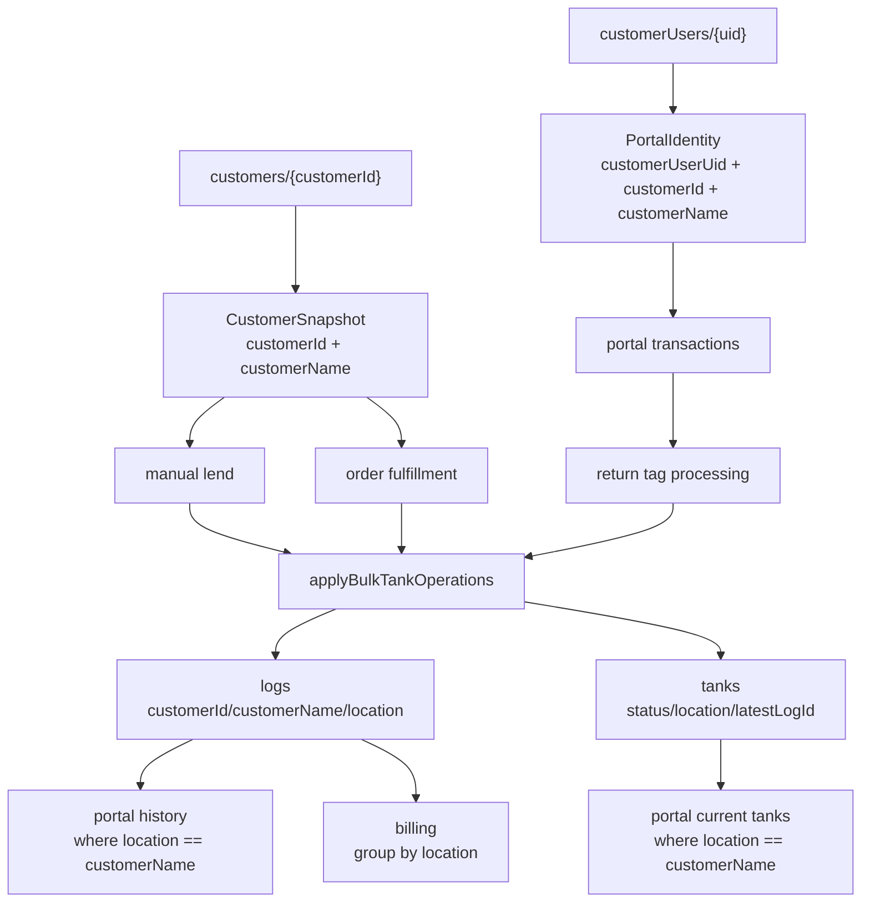

# customer identity / location normalization design

## 1. Purpose

この文書は、`customers/{customerId}` を貸出先・請求単位の正本として扱い、`tanks.location` や `logs.location` の顧客名文字列依存を段階的に外すための設計方針である。

目的は次のとおり。

- `customerId` を顧客 identity の正本にする
- `customerName` を表示用 snapshot として扱う
- `location` を現在場所・当時場所の表示文字列として扱う
- portal / staff / admin / billing が顧客名変更で切れない構造にする
- `tanks` / `logs` / `transactions` の責務を混同しない
- 将来の利益集計、共同作業者、報酬分割の前提を整える

今回の Phase 38-pre は docs-only の設計であり、実装コード、Firestore data、migration、backfill、rules、deploy は変更しない。

## 2. Current Data Flow

現状では、貸出時に `OperationContext.customer` が渡る経路では `logs.customerId` / `logs.customerName` が保存される。一方で `tanks` の現在貸出先は `location = customerName` が中心で、portal と一部集計はこの文字列に依存している。



現行の問題は、`logs` と `transactions` には `customerId` が入り始めているのに、`tanks` の current projection と portal query がまだ `location` 文字列を貸出先 identity として扱っている点である。

## 3. Field Responsibility Table

| Field | Collection | Current role | Target role |
|---|---|---|---|
| `customers/{id}` | `customers` | 顧客 master | 貸出先・請求単位の identity source of truth |
| `customerUsers.customerId` | `customerUsers` | portal user と customer の紐付け | portal actor が参照できる customer identity |
| `customerUsers.customerName` | `customerUsers` | portal 表示名 / rules 照合 | リンク時 snapshot。正本は `customerId` |
| `transactions.customerId` | `transactions` | order / return / unfilled の顧客 link | workflow の顧客 identity |
| `transactions.customerName` | `transactions` | workflow 表示 snapshot | 申請時・処理時の表示 snapshot |
| `logs.customerId` | `logs` | 操作対象 customer identity。一部経路では未設定 | 過去操作 event の customer identity |
| `logs.customerName` | `logs` | 操作時表示 snapshot | 当時表示名 snapshot |
| `logs.location` | `logs` | 操作後 location / 顧客名表示 | 当時の場所・貸出先表示 snapshot。identity query には使わない |
| `tanks.customerId` | `tanks` | 未実装 | 現在貸出中 customer identity projection |
| `tanks.customerName` | `tanks` | 未実装 | 現在貸出先表示 snapshot |
| `tanks.location` | `tanks` | 現在場所 / 顧客名 / 倉庫 / 自社などを兼ねる | 現在場所・表示 label。customer identity には使わない |
| `tanks.latestLogId` | `tanks` | 最新 active log link | current projection と revision / void 復元の接続点 |

## 4. Current Problems

| Area | Current dependency | Risk |
|---|---|---|
| portal home | `tanksRepository.getTanks({ location: customerName, status: "lent" })` | 顧客名変更で貸出中タンクが見えなくなる |
| portal return | `location == customerName` の貸出中タンク query | 返却申請対象が消える |
| portal unfilled | `location == customerName` の貸出中タンク query | 未充填報告対象が消える |
| portal history | `logsRepository.getActiveLogs({ location: customerName })` | 顧客名変更後の履歴が分断される |
| billing | `log.location` で grouping、`customers.name` で price lookup | 顧客名変更や同名顧客で請求がズレる |
| bulk return | `tank.location` で grouping | 顧客単位の正本にならず、改名・同名・空文字に弱い |
| staff dashboard | 貸出先 summary が `tank.location` grouping | 表示目的としては可。ただし identity 集計には使えない |
| manual return | context に customer がなく、return log が customer identity を失う | 返却履歴・請求・trace で customerId が途切れる |
| tank snapshots | `prevTankSnapshot` / `nextTankSnapshot` に customer fields がない | `tanks.customerId` 追加後、correction / void で復元できない |
| tank types | `TankDoc` に customer fields がない | repository / UI が current customer identity を読めない |

## 5. Target Schema

最終的には、既存 field を残しつつ、current projection と履歴 event の両方に customer identity を明示する。

```ts
type TankDoc = {
  id: string;
  status: TankStatusCode;
  customerId?: string | null;
  customerName?: string | null;
  location?: string;
  staff?: string;
  latestLogId?: string | null;
  updatedAt?: Timestamp;
  logNote?: string;
};
```

```ts
type LogDoc = {
  id: string;
  tankId: string;
  action: TankActionCode;
  transitionAction?: TankActionCode;
  prevStatus?: TankStatusCode;
  newStatus?: TankStatusCode;
  customerId?: string | null;
  customerName?: string | null;
  location?: string;
  prevTankSnapshot?: TankSnapshot;
  nextTankSnapshot?: TankSnapshot;
};
```

```ts
type TankSnapshot = {
  status: TankStatusCode;
  customerId?: string | null;
  customerName?: string | null;
  location?: string;
  staff?: string;
  logNote?: string;
};
```

`transactions` はすでに workflow identity として `customerId` / `customerName` を持つため、Phase 38 の初期対象では schema 変更しない。

## 6. Write Policy

`tanks.customerId` / `tanks.customerName` は現在貸出先の projection として扱う。履歴の正本は引き続き `logs` だが、日常画面の current loan query は `tanks` を読む。

| Operation | `tanks.customerId` | `tanks.customerName` | `tanks.location` |
|---|---|---|---|
| manual lend | `context.customer.customerId` | `context.customer.customerName` | 当面 `customerName` を維持 |
| order fulfillment | `order.customerId` | `order.customerName` | 当面 `order.customerName` を維持 |
| normal return | `null` | `null` | `倉庫` |
| unused return | `null` | `null` | `倉庫` |
| uncharged return | `null` | `null` | `倉庫` |
| keep / carry over | 現在の customer identity を維持 | 現在の customer snapshot を維持 | 現在 location を維持 |
| return tag processing | return は clear、keep は維持 | return は clear、keep は維持 | 既存仕様に従う |
| fill | `null` | `null` | `倉庫` または既存仕様 |
| inhouse use | `null` | `null` | 自社利用先表示 |
| inhouse return | `null` | `null` | `倉庫` |
| damage / repair / inspection | 変更前 status / 業務意味を audit してから決める | 同左 | 既存仕様を維持 |
| procurement | `null` | `null` | 登録時の保管場所 |

重要な制約:

- `customerId` と `location` を同一概念として扱わない
- `location` は表示互換のため当面残す
- `OperationContext.customer` がある貸出系 operation では、`logs` と `tanks` の両方へ customer identity を反映する
- return 系で customer identity を失う経路は、`tanks` の current snapshot から補えるように設計する
- procurement は通常の tank operation に無理に統合しない

## 7. Query Policy

query は段階的に `customerId` へ寄せる。

| Current query | Target query |
|---|---|
| portal current loans: `tanks.status == "lent" && tanks.location == customerName` | `tanks.status == "lent" && tanks.customerId == customerId` |
| portal return targets | `tanks.status == "lent" && tanks.customerId == customerId` |
| portal unfilled targets | `tanks.status == "lent" && tanks.customerId == customerId` |
| portal history: `logs.location == customerName` | `logs.customerId == customerId` |
| billing grouping: `logs.location` | `logs.customerId` grouping、表示は customer master / snapshot fallback |
| bulk return grouping: `tank.location` | `tank.customerId ?? location` で key、表示は customerName/location |
| dashboard current loan summary | 表示目的なら location 可。identity 集計なら customerId |

`tanksRepository.getTanks()` には将来的に `customerId?: string` を追加する。ただし、実装時は portal / staff / admin の query pivot と同時に扱い、`location` option を急に削除しない。

## 8. UI Display Policy

UI 表示は以下の優先順位にする。

1. 現在 master を明示的に読む画面では `customers.name || companyName`
2. 現在貸出中 tank の表示では `tank.customerName`
3. 過去ログ表示では `log.customerName`
4. 互換 fallback として `location`
5. 最後に `不明`

表示名として `customerName` や `location` を出すことは許可する。ただし、検索・請求・権限・集計の正本 key として使わない。

raw `customerId` は通常 UI に出さない。調査・admin debug 用に出す場合は、明示的な補助表示として扱う。

## 9. Revision / Void Policy

`tanks.customerId` / `tanks.customerName` を追加する場合、`tank-operation.ts` の snapshot chain を先に拡張する必要がある。

必要な対応:

- `TankSnapshot` に `customerId?: string | null` と `customerName?: string | null` を追加する
- `snapshotFromTankData()` が tank の customer fields を読む
- `tankUpdateFromSnapshot()` が customer fields を restore / delete できる
- `prevTankSnapshot` / `nextTankSnapshot` に customer fields を保存する
- `applyLogCorrection()` の `patch.customer` が tank snapshot にも反映される
- `voidLog()` が customer fields を含む previous snapshot に戻せる

この順序を守らずに `tanks.customerId` だけを書き始めると、dashboard correction / void 後に customer projection が壊れる。

## 10. Portal Policy

portal の identity は Firebase Auth uid と `customerUsers/{uid}` を入口にする。

方針:

- linked portal user だけが `customerId` query の対象になる
- portal current loan / return / unfilled は `customerId` query へ寄せる
- portal history は `logs.customerId` query へ寄せる
- `customerUsers.customerName` は表示 snapshot / rules 照合用であり、query 正本にしない
- `customerSession.uid` が `customerId || uid` になる互換挙動は将来整理対象だが、Phase 38 初期実装では触らない
- unlinked portal order は既存の `pending_link` workflow を維持する

Rules について:

- `tanks.customerId` を portal read 条件にする場合、Security Rules の read 条件も customerId 正本に合わせる必要がある
- `firestore.rules` は下書き扱いのため、Rules deploy は別レビュー対象にする
- Rules / index / Hosting deploy を同じ判断に混ぜない

## 11. Billing Policy

billing は `logs.customerId` を集計 key にする。

移行方針:

- 貸出対象判定は既存の action classification helper を使う
- customer grouping は `log.customerId` を優先する
- price lookup は `customers/{customerId}` を優先する
- 表示名は `customers.name || log.customerName || log.location || "不明"`
- `log.location` grouping は fallback に留める
- 同名 customer を同じ請求先としてまとめない
- customerName 変更後も同じ customerId の請求が継続することを smoke test に含める

legacy fallback は実運用前のため長期互換目的ではなく、検証データや中間フェーズでの空表示回避に限定する。

## 12. Firestore Index / Rules

想定される query:

- `tanks`: `status == "lent"` + `customerId == <id>`
- `tanks`: `status in ["lent", "unreturned"]` + optional customer grouping
- `logs`: `logStatus == "active"` + `customerId == <id>` + `timestamp desc`
- `logs`: billing range + customerId grouping は、まず全 active logs の client aggregation から開始し、必要なら repository query を設計する

既存 docs には `logs(logStatus Asc, customerId Asc, timestamp Desc, __name__ Desc)` index が必要と記録されている。
`tanks.status + customerId` の複合 index は、実装時の Firestore エラーまたは Firebase Console の必要表示で確認する。

Rules は Phase 38 の初期 docs / type prep / write prep では変更しない。
portal read を customerId query に移す段階で、Rules policy を別途確認する。

## 13. Rollout Order

推奨順序:

1. **Phase 38-pre: docs-only audit**
   - この文書を作成する
   - 実装コードは変更しない

2. **Phase 38A: type / repository preparation**
   - `TankDoc` / repository `toTankDoc` に `customerId` / `customerName` を追加
   - `GetTanksOptions` に `customerId` を追加
   - Firestore write はまだ変更しない

3. **Phase 38B: tank-operation snapshot preparation**
   - `TankSnapshot` に customer fields を追加
   - `snapshotFromTankData` / `tankUpdateFromSnapshot` / correction / void の復元を対応
   - まだ caller の業務仕様は広げない

4. **Phase 38C: write pivot for current customer projection**
   - lend / order fulfillment で `tanks.customerId/customerName` を保存
   - normal / unused / uncharged return で clear
   - keep で維持
   - fill / inhouse / procurement は既存仕様を明示的に確認して最小対応

5. **Phase 38D: portal query pivot**
   - portal home / return / unfilled を `customerId` query へ移行
   - portal history を `logs.customerId` query へ移行
   - Rules / index 要否を確認

6. **Phase 38E: staff read model pivot**
   - bulk return grouping
   - staff dashboard current loan summary
   - dashboard correction UI の貸出先変更

7. **Phase 38F: billing pivot**
   - billing grouping / price lookup を customerId 主軸にする
   - customerName/location fallback は表示だけに限定する

8. **Phase 38G: cleanup**
   - `location == customerName` query を削除または縮小
   - docs / smoke test 結果を更新

## 14. Deploy / Smoke Test Plan

deploy 方針:

- docs-only は deploy しない
- code-only で Hosting だけ必要な場合は `firebase --project okmarine-tankrental deploy --only hosting`
- Firestore Rules は別レビュー対象。無指定 deploy は行わない
- Firestore data direct edit / migration / backfill は行わない

smoke test:

1. 通常 UI で test customer / test tank を確認する
2. `filled -> lend -> lent` を実行し、`tanks.customerId` と `logs.customerId` が入ることを画面挙動から確認する
3. portal linked user で貸出中 tank が `customerId` query で見えることを確認する
4. portal return request を作成し、staff return confirmation で `completed` まで進むことを確認する
5. normal return 後、tank の customer projection が clear されることを確認する
6. fill 後、`filled` として扱われることを確認する
7. billing が customerId 単位で貸出を数えることを確認する
8. customerName を変更しても portal / billing が切れないことを、別 Phase の安全条件下で確認する
9. dashboard correction / void は、customer snapshot 復元が入った後に確認する

## 15. Do Not Touch Yet

Phase 38 の初期段階では以下を触らない。

- collaborators / payout
- incentive schema
- customer data の直接編集
- migration / backfill
- SMOKE_TEST 削除
- Firestore Console 操作
- `firebase.json`
- package files
- 無指定 Firebase deploy
- Security Rules deploy
- `transactions.status` の意味変更
- `logs` と `transactions` の責務統合
- portal unlinked order workflow の再設計

## 16. Decision

Phase 38 の結論:

- `customerId` を貸出先・請求単位の正本にする
- `customerName` は表示 snapshot として残す
- `location` は現在場所 / 当時場所の表示文字列として残す
- `tanks.customerId/customerName` は current projection として追加する方向で進める
- `logs.customerId/customerName` は過去 event の identity / snapshot として維持する
- `transactions.customerId/customerName` は workflow identity / snapshot として維持する
- `location == customerName` query は段階的に廃止する
- 実装は docs -> type/repository prep -> snapshot prep -> write pivot -> query pivot -> billing pivot -> cleanup の順で分割する
